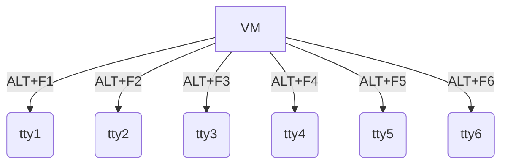
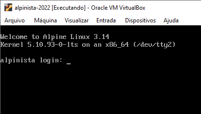

# Bem-vindo ao Alpinista

Alpinista é uma máquina virtual (VM, da sigla em inglês) com o sistema operacional [Alpine Linux](https://alpinelinux.org/). 

Tenha em mente que esta VM possui dois usuários que podem interagir com o sistema via terminal:

- Usuário `root`, sem senha
- Usuário `regente`, com senha `regente`

Você pode usar estes usuários de várias maneiras:

- Via console local
- Acesso remoto via SSH
- Acesso remoto via SMB

## Consoles locais

Em sua VM, há 6 consoles para execução de comandos. Para alternar entre elas, use a combinação de teclas `ALT`+`F{{x}}`, onde `{{x}}` é o número do terminal (Vide a próxima imagem). A propósito, os terminais no Linux são conhecidos como *tty*, uma abreviação para _TeleTYpewriter_ (Escritor de teletipo em inglês). Em qualquer uma das consoles, você poderá se autenticar com o usuário *root* ou o usuário *regente*.

A próxima imagem exibe a solicitação de autenticação (*login:*) para o terminal `tty2`.

## Acesso SSH

Para fazer um acesso remoto via SSH, você deve instalar primeiro um cliente SSH. No Windows, instale o [git](https://git-scm.com/download/win) e posteriormente abra o terminal *Git Bash* e faça os seguintes passos:

1. Execute o comando: `ssh regente@192.168.56.21`
2. Digite `yes` para aceitar a chave pública do servidor
3. Digite a senha `regente` quando solicitada
4. Caso deseje se tornar administrador, execute o comando: `su -`
5. Para sair de qualquer uma das sessões, execute o comando `exit`

Veja simulação dos passos anteriores no seguinte vídeo:

Se você é usuário novato do terminal do Linux, procure se familiarizar com os [comandos básicos](comandos/basicos.md).

